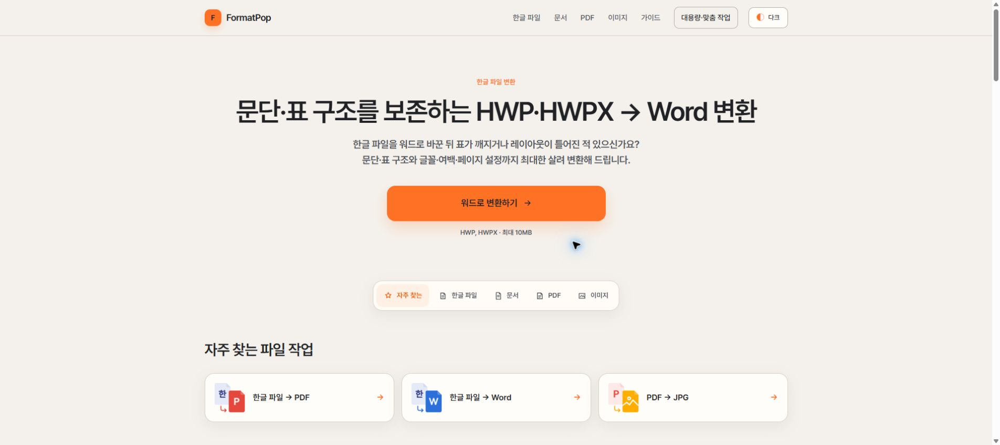

# FormatPop

### 문서의 구조를 살려 다시 편집할 수 있도록

HWP·HWPX의 문단과 표 구조 보존을 우선해 편집 가능한 Word 문서로 변환하고, 
PDF·이미지 작업을 함께 제공하는 웹 서비스입니다.

[서비스 이용하기](https://formatpop.com/) · [공식 문의](mailto:contact@formatpop.com)

> 이 저장소는 FormatPop의 문제 해결 과정과 설계 판단을 소개하는 공개 쇼케이스입니다. 
> 실제 운영 소스 코드, 내부 설정, 변환 규칙과 테스트 자료는 포함하지 않습니다.

## 프로젝트 개요

| 구분 | 내용 |
| --- | --- |
| 형태 | 1인 프로젝트 |
| 담당 | 문제 정의, 서비스 기획, 문서 변환 구조, UI·사용 흐름, 개발, 배포·운영 |
| 현재 | [formatpop.com](https://formatpop.com/) 배포 및 개선 중 |
| 핵심 기술 | Astro, React, TypeScript, Rust/WASM, Web Worker, Python, FastAPI |

## 제작 배경

제안요청서 기반 RAG 프로젝트에서 HWP 문서를 다루며, 일반 텍스트 변환이나 기존 변환 방식으로는 문단의 배치와 표·병합 셀 구조가 깨져 결과물을 다시 편집하거나 데이터로 활용하기 어렵다는 문제를 확인했습니다.

변환이 실행됐다는 사실보다 **문서가 가진 관계를 얼마나 살려 다시 사용할 수 있는가**가 더 중요하다고 보았습니다. 이 문제의식을 HWP·HWPX 변환 서비스로 확장하고, 반복해서 필요한 PDF·이미지 작업도 한곳에서 처리할 수 있도록 FormatPop을 만들었습니다.

## 해결 목표

- 문단 순서와 표의 행·열, 병합 셀 등 문서 구조 보존
- 변환 결과를 다시 편집하고 활용할 수 있는 형태로 제공
- 불필요한 원본 파일 전송과 서버 처리를 줄이는 구조
- 파일 선택부터 결과 다운로드까지 이어지는 사용 흐름
- 처리 위치와 지원 범위, 변환 후 확인 사항의 명확한 안내

## 주요 기능

- HWP·HWPX → Word·PDF·TXT 변환
- Word → HWPX·PDF·TXT·Markdown 변환
- PDF 분할·병합·페이지 추출·회전·이미지 변환
- 이미지 형식 변환·압축·크기 조절과 OCR
- 기능별 사용 방법과 변환 차이를 설명하는 문서 가이드

현재 문서·PDF·이미지 작업을 위한 24개 도구를 제공하며, 실제 문서에서 발견한 구조 손실 사례를 반영해 계속 개선하고 있습니다.

## 설계 판단

### 처리 위치의 분리

모든 기능을 서버에서 처리하면 필요하지 않은 원본까지 외부로 전송되고 서버 연산·스토리지·트래픽도 증가합니다. 기능의 특성에 따라 처리 위치를 나누었습니다.

| 처리 방식 | 적용 범위 | 이유 |
| --- | --- | --- |
| 브라우저 처리 | 17개 PDF·이미지 도구 | 원본과 결과를 사용자 기기 안에서 처리해 파일 전송 범위와 서버 비용을 줄임 |
| 서버 처리 | HWP·HWPX 변환, OCR 등 | 브라우저 처리가 어려운 기능만 분리하고 입력과 결과를 영구 보관하지 않음 |

### 결과를 다시 쓸 수 있는 변환

글자만 옮기는 대신 문단·표·병합 셀을 공통 문서 구조로 복원한 뒤 결과 형식에 맞게 재구성했습니다. 실제 문서의 원본과 변환 결과를 대조하며 문단과 이미지의 순서, 표의 행·열, 병합 셀과 중첩 표, 편집 가능 여부를 확인합니다.

새로운 오류가 발견되면 해당 구조를 검증 표본에 추가해 수정 뒤에도 기존 문서가 동일하게 처리되는지 다시 확인하고 있습니다.

### 사용 흐름과 안내

도구를 종류별로 나누고, 파일 선택·옵션 설정·처리 상태·결과 다운로드가 한 흐름으로 이어지도록 구성했습니다. 지원 범위와 파일 처리 방식, 변환 뒤 확인할 사항을 가이드로 제공해 사용자가 결과를 직접 판단할 수 있도록 했습니다.

## 담당 범위

- RAG 프로젝트에서 확인한 문서 구조 손실을 서비스 요구사항으로 구체화
- 기능 범위와 브라우저·서버 처리 경로 설계
- 문서 변환 구조와 웹 화면 구현
- 실제 문서를 이용한 변환 결과 검증과 오류 개선
- 서비스 배포, 파일 처리 안내와 문서 가이드 작성

## 공개 범위

이 저장소에는 프로젝트 소개 문서와 공개 서비스 화면만 포함합니다. 다음 항목은 비공개로 유지합니다.

- 운영 소스 코드와 저장소 이력
- 문서 파싱·변환 규칙과 내부 데이터 구조
- API·배포 설정과 환경 변수
- 테스트 코드와 원본 시험 문서

## 저작권 및 문의

이 저장소는 오픈소스가 아니며 별도의 사용권을 부여하지 않습니다. 자세한 내용은 [NOTICE.md](./NOTICE.md)를 확인해 주세요.

- 서비스: [https://formatpop.com](https://formatpop.com/)
- 공식 문의: [contact@formatpop.com](mailto:contact@formatpop.com)

Copyright © 2026 YSY Works. All rights reserved.
